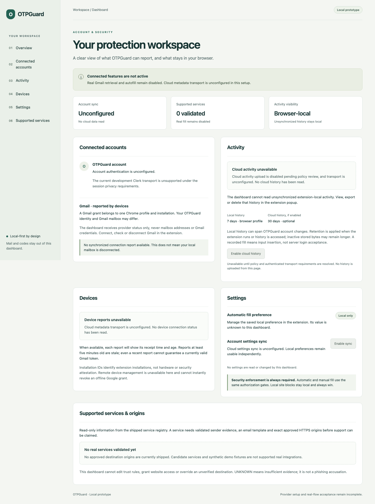

# OTPGuard

A Chrome MV3 portfolio prototype exploring local email-code authorization. Its separate
synthetic extension demonstrates document-bound fill and refusal; the production extension
provides local preferences/history and an optional Gmail connection lifecycle.
**Real email retrieval and autofill are disabled. No real services are supported yet.**

The responsive web dashboard explains account, device, history and service states.
Authentication and cloud transport are unconfigured; cloud activity upload is policy-disabled.
This is a reviewable prototype, not a publicly distributable security product.



## Start here

Use Node **22.19.0** and Bun **1.4.2**, with ports **3100** and **3001** free.
From a fresh clone with no provider environment files or exported provider variables:

```sh
bun install --frozen-lockfile
NEXT_TELEMETRY_DISABLED=1 bun run build
bun run build:mock
bun run check
bun x --no-install playwright install chromium
bun run test:browser
```

Linux browser prerequisites: `bun x --no-install playwright install --with-deps chromium`.
Tests inspect generated artifacts, so builds must precede checks. No credentials or provider
setup are required. See [setup and demo](documentation/setup-demo.md) for the interactive
walkthrough, configured-artifact precautions, test commands and troubleshooting.

## What can be demonstrated

| Capability                                                                        | Current boundary                                                                    |
| --------------------------------------------------------------------------------- | ----------------------------------------------------------------------------------- |
| Synthetic single/split fill, leading zeros, mismatch and ambiguity refusal        | Separate development artifact and loopback fixtures only; fabricated trust evidence |
| Popup preferences, exact HTTPS blocks, local history export/delete                | Profile-local; preference cannot enable production fill or disable verification     |
| Gmail connect/check/disconnect                                                    | Optional registered public configuration; connection does not enable mail retrieval |
| Six-section dashboard                                                             | Responsive unconfigured UI; no extension storage bridge or cloud data source        |
| Parser, bounded MIME/retrieval, account cancellation, backend ownership/retention | Unit and offline backend evidence; no validated live connected flow                 |
| Supported real services/origins                                                   | **Zero**: production registry is empty, sender UNKNOWN, receipt unverified          |

Numeric 4–8-character English synthetic templates and top-level light-DOM single/split
fixtures are exercised. Real GitHub, Google, Microsoft, Discord and Amazon flows are not
supported. Iframes, shadow roots, alphanumeric codes, magic links, copy/reveal overrides,
auto-submit, multiple mailboxes, incognito and Firefox are outside current coverage.
Email OTPs are not phishing-resistant; any page receiving an input value can read it.

## Engineering and distribution

- [Architecture and security decisions](documentation/architecture.md)
- [Independent native auth development prototype](documentation/native-auth-prototype.md)
- [Privacy and data handling](documentation/privacy.md)
- [Threat model and audit disposition](documentation/threat-model.md)
- [Completed local release fixes and validation](documentation/local-release-readiness.md)
- [Packaging and release gates](documentation/release-readiness.md)
- [Screenshot provenance](documentation/images/README.md)

The extension now uses an explicit Bun MV3 builder. Removing Plasmo/Parcel reduced the
default artifact from 312 MB to 2.56 MB; the current locked dependency audit reports **zero
advisories**. Extension hot reload is unavailable; use production build/reload only.
Google restricted-scope verification, assessment applicability and Chrome Web Store review
are unresolved. [Release readiness](documentation/release-readiness.md) distinguishes local
packaging from approval to publish. No deployment or store release is supplied.

Source layout: `apps/extension` (Bun MV3/React 18), `apps/web` (Next.js/React 19),
`packages/otp` and `packages/security` (pure logic), `packages/shared` (closed contracts),
`convex` (offline-tested backend), `development/mock-extension` and `tests/fixtures`
(synthetic only). Existing [CI](.github/workflows/ci.yml) installs the lockfile, builds,
checks, audits dependencies and verifies extracted review packages in isolated Chromium without credentials.
After the setup checks, run `bun run package:review` and `bun run check:packages` with
`zip`/`unzip` installed and port 3201 free.
