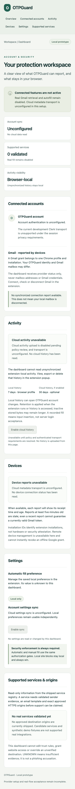
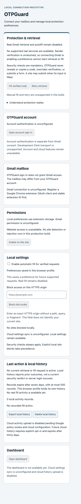
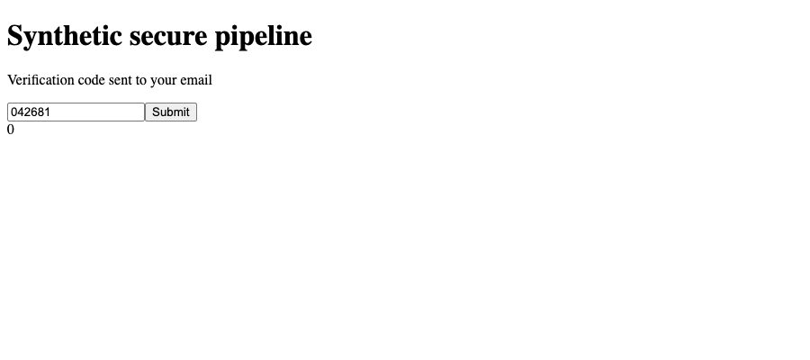
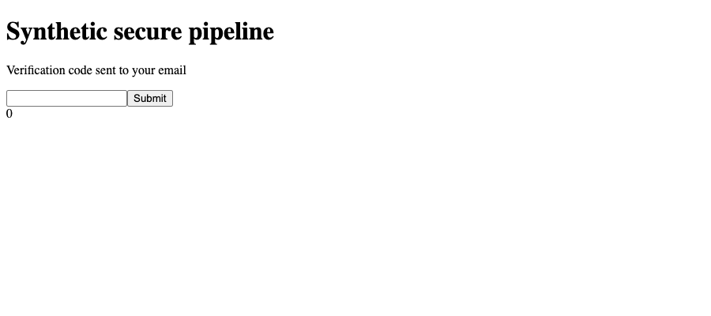

# Screenshot provenance

These checked-in PNGs were generated from current source in isolated Playwright Chromium,
with no signed-in browser profile, provider credentials, mailbox, live OTP or cloud endpoint.
They are portfolio illustrations, not evidence of a real connected service.

| Asset                 | Source/state                                                                       |
| --------------------- | ---------------------------------------------------------------------------------- |
| dashboard-desktop.png | Local production web root, 1440px; authentication/cloud unconfigured               |
| dashboard-mobile.png  | Same source, 380px; unconfigured responsive layout                                 |
| popup.png             | Rebuilt default production extension popup; unconfigured identities, empty history |
| synthetic-fill.png    | Separate mock extension on loopback safe fixture; fabricated 042681 only           |
| synthetic-refusal.png | Separate mock extension on mismatch fixture; empty field                           |

Capture date: October 3, 2026 (owner timezone). No browser chrome, account cookies, tokens,
email content or credential-bearing URLs are included. The demo code is deliberately synthetic.
To recreate, follow setup-demo, launch disposable Chromium contexts, take page-content captures
at the stated viewports after expected headings/values appear, then inspect every image before
sharing. Never substitute personal profile screenshots. Only explicit asset capture creates
images; routine tests retain trace/video/screenshots off.

## Gallery

