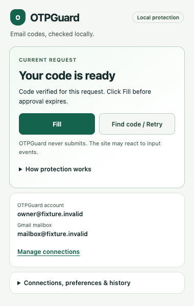
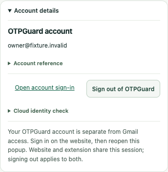

# Popup polish — first owner-selected pass

Date: October 4, 2026. Local review on `codex/popup-ux-polish`, based on
`de3bf0d`. Proposed title: `feat(extension): polish the Canva popup journey`.
No commit, publication, merge, deployment or installed-extension replacement is
claimed. This scope excludes new services, dashboard work and provider changes.

## Result and acceptance

- **Achieved:** current request and Fill/Retry come first; readable idle, search,
  ready, filled, no-mail, unknown, mismatch, block, cancellation and error guidance.
  The READY view fits within 380 × 600, with Fill above the fold. Approval expiry
  and failed automatic prompt opening retain explicit explanations.
- **Achieved:** separate account and mailbox identities stay visible. Connection,
  permission, preference, history and build controls use native expandable panels
  under one management disclosure. Detailed grant/revocation/restoration notices,
  protection limitations and disabled cloud controls remain available.
- **Achieved:** keyboard Enter/Space disclosure operation, checkbox navigation,
  focus outlines, live request announcements and closed-state disabled actions
  have synthetic browser coverage. Saving the automatic-prompt preference restores
  checkbox focus after temporary disabling, unless focus moved to another control.
- **Achieved:** visible Canva pilot identity, plus popup-pass/engine/version and
  exact extension ID in Build & dashboard. No additional permission or stored data.
- **Unverified:** owner-profile acceptance of this new popup, assistive-technology
  testing with an actual screen reader and long/translated identity labels. Core 4
  owner-assisted lifecycle/concurrency and full live privacy checks remain deferred
  as recorded in [Core 4 acceptance](core-4-acceptance.md), not passed by this work.

All preview identities and request states are fabricated in an isolated Chromium
profile; no code, real mail, credentials or owner profile were captured.

## Files and decisions

`apps/extension/popup.tsx` and `popup.css` implement the presentation and focus
repair. Browser foundation/Gmail tests now open disclosures before exercising
existing controls. `tests/browser/popup.spec.ts` adds synthetic request-state,
request-ID forwarding, explicit-click-only message, expiry, layout and keyboard
coverage. No architecture change or new ADR is needed. ADR0020/0021 still govern
clicked insertion, privacy, replay limits and safe remembered Gmail restoration.

## Validation

Commands use Bun 1.4.2 at `/tmp/otpguard-runtime/bun-darwin-aarch64/bun` (called
`bun` below). Temporary exports contain tracked baseline plus the changed popup
and test files, with no owner env files. Browser commands use that Bun directory
in PATH and explicit local-server/Chromium execution permission.

| Command / context                                                                                                                                                                                 | Result                                                                                                                                                                         |
| ------------------------------------------------------------------------------------------------------------------------------------------------------------------------------------------------- | ------------------------------------------------------------------------------------------------------------------------------------------------------------------------------ |
| `bun run check` in checkout                                                                                                                                                                       | Passed type checks, lint, formatting and all 383 unit tests in 29 files                                                                                                        |
| `bun install --frozen-lockfile && bun run build && bun run build:mock` in `/private/tmp/otpguard-popup-polish-review`                                                                             | Passed; final popup-only rebuild also passed                                                                                                                                   |
| `OTPGUARD_POPUP_PREVIEW=/private/tmp/otpguard-popup-polish-ready.png bun run test:browser` in review export                                                                                       | 34 passed, one configured Gmail case skipped                                                                                                                                   |
| `bun /private/tmp/otpguard-popup-polish-gmail-ui.ts`                                                                                                                                              | All 3 Gmail UI cases passed using separate Gmail-only public-config fixture; denial/reconnect/mailbox change/unconfirmed revocation simulated, zero external requests asserted |
| `OTPGUARD_POPUP_PREVIEW=/private/tmp/otpguard-popup-polish-ready.png bun node_modules/@playwright/test/cli.js test tests/browser/popup.spec.ts tests/browser/foundation.spec.ts` in review export | Final 4 targeted cases passed, including keyboard save-focus repair and synthetic state previews                                                                               |
| `bun /private/tmp/otpguard-popup-polish-build.ts`                                                                                                                                                 | Isolated combined public-config build and all 5 configured manifest/artifact checks passed                                                                                     |
| `git diff --check`                                                                                                                                                                                | Passed                                                                                                                                                                         |

Initial local browser startup lacked execution permission and did not run tests.
The first isolated full run found the checkbox focus issue (33 passed, one failed,
one skipped); the final run above passed after repair. An initial configured-export
build could not resolve workspace dependencies through a root-only symlink;
installing frozen dependencies in that export resolved it. Neither failure involved
owner credentials or provider actions.

The configured review artifact is:
`/private/tmp/otpguard-popup-polish-configured/apps/extension/build/chrome-mv3-prod`.
It uses the existing combined identity `jfncecbkgdnhdppgpblbokkceflpmgif` and reviewed
public configuration. Its `manifest.json`, `background.js` and `content.js` are
byte-for-byte identical to the installed Core 4 v5 artifact. Manifest SHA-256:
`54561669b97c9c88bf9703cbb877a15b893a719f0e1bde50547e3905511c99cb`.
No owner installation was replaced; review exports are independent.

## Owner review steps

1. Inspect the synthetic preview and local diff. Expand Connections, preferences
   & history, then the account/mailbox panels to confirm identities remain distinct.
2. Use Tab and Enter/Space through disclosure controls. Toggle the automatic-prompt
   preference and confirm focus stays on the checkbox after saving.
3. On a privately exercised supported challenge, review SEARCHING → READY, click
   Fill yourself, then complete login yourself. Confirm no code is shown in popup
   and insertion remains separate from server login success.
4. Let an approval expire or exercise a no-mail search; verify Fill is disabled
   and the explanation offers a safe next step. Keep real codes/mail out of review
   screenshots, logs and evidence.

Installed owner-profile steps require deliberately loading the review artifact;
this pass did not do so. Stop for owner review. A second popup refinement pass may
follow owner feedback; no next scope is started.

## Owner screenshot revision — native popup width

The owner's installed-popup screenshot showed a narrow column with heavily wrapped
text and buttons. An isolated `chrome.action.openPopup()` measurement reproduced
192 CSS pixels for both viewport and main content at default zoom. The preceding
380 × 600 preview exercised a normal tab and missed Chrome's native intrinsic sizing.

Giving `html` and `body` an explicit 380px width/minimum width and removing main's
`100vw` cap changes the same native measurement to 380px. The cap previously let the
initial popup viewport constrain content before Chrome chose its final window size.
The configured artifact in the same review folder was rebuilt. No worker, content,
permission or authorization changes were required.

`tests/browser/popup.spec.ts` now opens the actual action popup and measures its
separate CDP target, checking viewport/content width, horizontal overflow and button
width. The isolated measurement helper failed with `Native popup width 192; expected
380` before the fix and passed with width/main both 380 afterward. The final targeted
popup/foundation/Gmail browser command passed seven cases with the configured Gmail
simulation skipped; its earlier separate configured result remains recorded above.
Type/lint/format, 383 unit tests and five configured artifact checks passed again.

To pick up the rebuilt files, close the popup, click Reload for the combined
extension on `chrome://extensions`, then reopen it. Keep the same review-artifact
folder and extension ID; no new connection or provider setup is needed for this CSS
fix. Owner confirmation of the corrected installed appearance remains pending.

## Owner review and general product wording

The owner reported that the corrected popup works and looks good, then requested
less Canva-specific presentation. The header now says “Local protection”; the
request eyebrow, search/ready/idle/completion guidance and submission caveat use
general product wording. “How protection works” explicitly states that current
coverage is Canva email-code login only. Exact Canva permission controls remain
service-specific; support and authorization rules are unchanged. This records owner
feedback, not a new claim that every deferred live acceptance case passed.

The same configured review folder was rebuilt. General wording/native sizing and
keyboard tests passed (five targeted browser cases), together with type/lint/format,
383 unit tests and five configured artifact checks. The synthetic preview above
reflects this revision. Reload the existing combined extension to review it.

## Continued popup UI/UX — connections and supporting panels

The owner requested continued UI/UX work. This pass stays on the same popup branch:
no website/dashboard redesign or additional service work. The connection overview
now offers a direct button into the relevant account or Gmail panel and focuses its
summary. That button only changes presentation; it sends no worker/provider action.

Account reference and cloud-identity diagnostics use secondary disclosures. Shared
website/extension sign-out remains clearly described. Gmail's all-mail readonly scope
and browser-account selection notice stay visible before Connect, with detailed
consent/restoration explanation available separately; project-wide revocation warning
and confirmation remain intact. Preferences use a clearer checkbox row, blocked sites
have compact labelled removal controls, and history has a readable empty/last-action
card, separate timestamp and busy feedback. Existing storage, grant, security and
clicked-fill contracts are unchanged.

Validation: `bun run check` passed all static checks and 383 unit tests. The targeted
popup/foundation/Gmail Chromium command passed seven cases with the configured case
skipped; separate configured Gmail simulation passed three cases. The direct link's
focus/disclosure and zero-worker-action behavior are asserted, alongside native width,
READY height, expiry, keyboard, settings/block/history and worker failure checks.
Five configured artifact checks passed, and manifest/worker/content remain identical
to v5. Synthetic READY and expanded connection previews were inspected; the report's
preview was refreshed. The configured review folder was rebuilt for owner reload.
Owner-profile acceptance of this supporting-panel revision remains pending.

## Owner spacing revision

The owner requested spacing refinement after reviewing the expanded account panel.
Account sign-in and sign-out now use a two-column action row with a 10px gap and
aligned controls. Expanded-panel content uses a consistent 12px vertical rhythm;
secondary disclosures have tighter padding, and panel bottoms retain 15px breathing
room. The single-action unconfigured state spans the row. No action handlers changed.

`bun spacing-preview.ts` in the isolated review export checked the configured popup
with fabricated account/mailbox identities: gap 10px, same row, no horizontal overflow,
and zero external requests. Its screenshot was inspected. Five targeted popup and
foundation browser cases passed, including keyboard and native sizing; static checks,
383 unit tests and five configured artifact checks also passed. The same configured
review folder was rebuilt. Owner confirmation after Reload remains pending.
