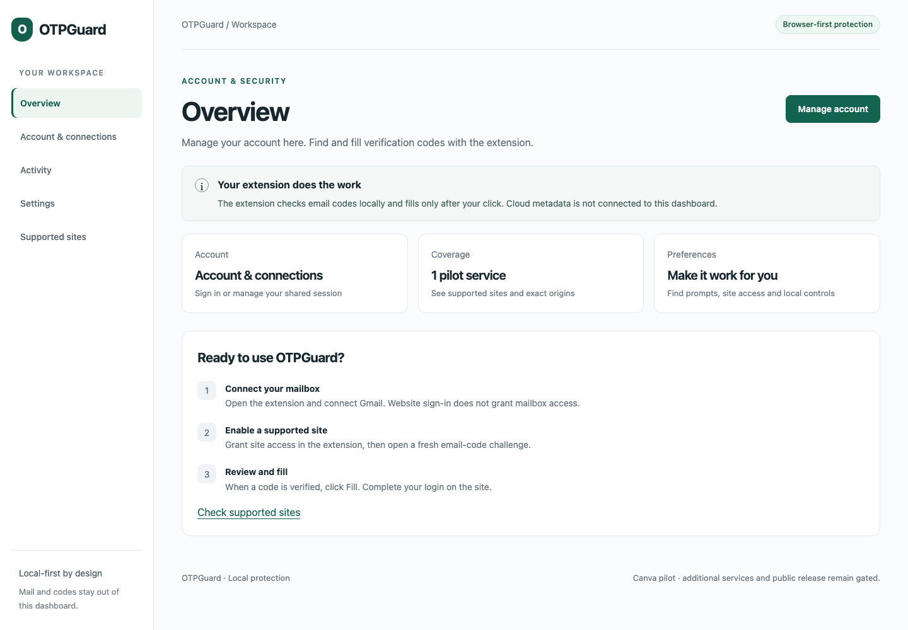
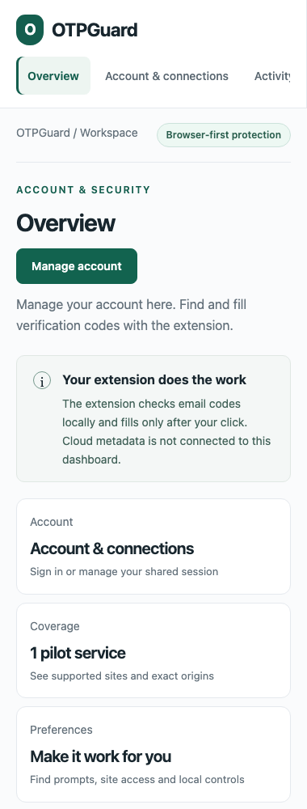
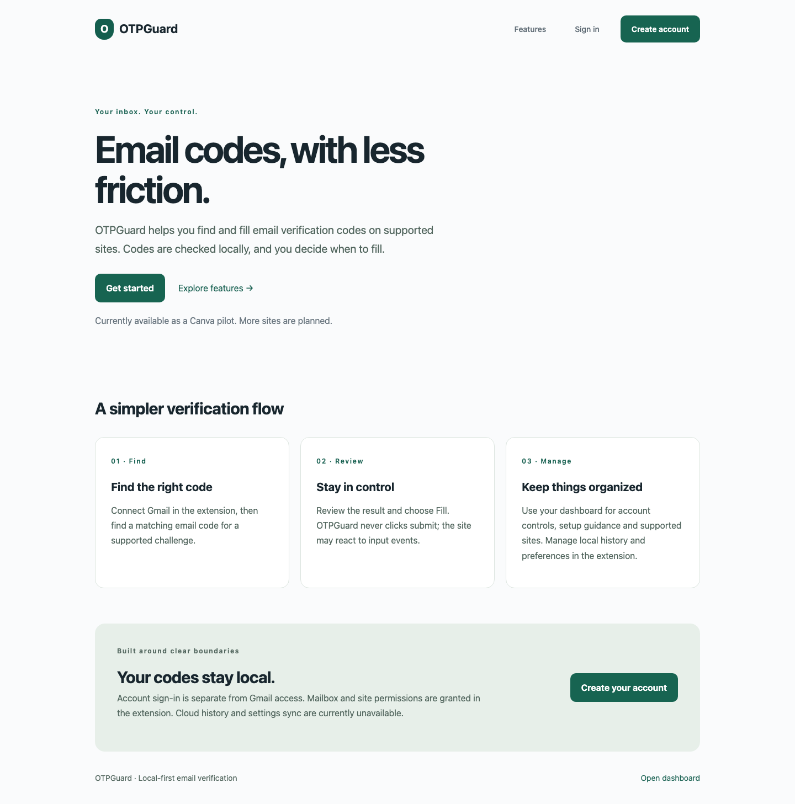
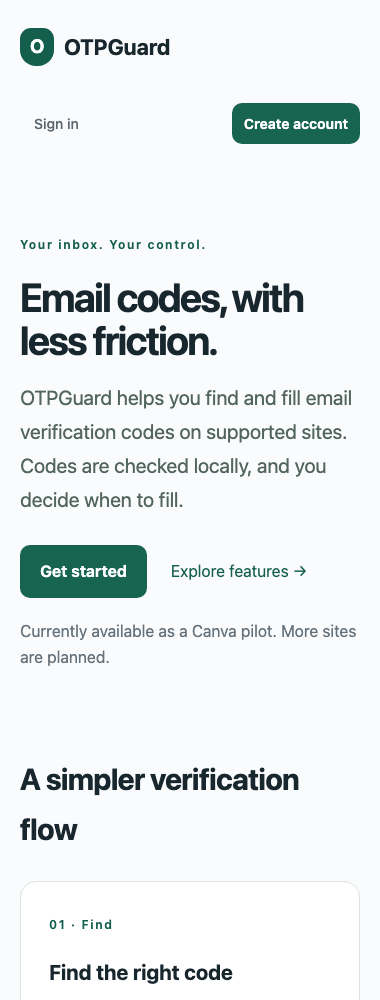

# Website UI/UX — owner-selected workspace pass

Date: October 4, 2026. Local review on `codex/website-ux-polish`, based on `5e87580`.
Proposed title: `feat(web): add feature landing and authenticated dashboard`.

The owner approved committing, merging and pushing popup polish, now on `main` and
`origin/main` as `5e87580`, and requested website UI/UX work. After rejecting the first
visual pass and its scrolling sidebar, the owner requested a clean, modern, useful
workspace with meaningful navigation. This report describes the revised result.
Website changes remain local: no website commit, merge, push or deployment in this pass.

## Result and acceptance

- **Achieved:** light navigation, clear active state and focused Overview, Account &
  connections, Activity, Settings and Supported sites views. Selecting navigation
  switches the visible view rather than scrolling through one long status page.
  Device reports are secondary information within account/connections.
- **Achieved:** overview cards lead to account controls, supported origins and preference
  directions. Setup steps explain the actual mailbox → site access → clicked Fill journey.
  The account view retains the existing Clerk sign-in/profile/shared-session controls.
- **Achieved:** Settings provides concrete directions to automatic prompts, site blocks,
  permission and history controls in the extension. Activity explains where local
  history can be viewed/exported/deleted. Unavailable cloud controls and technical
  retention information are secondary disclosures, with original capability gates intact.
- **Achieved:** native hash links, refresh/deep links, Back/Forward, active `aria-current`,
  keyboard skip/focus behavior and responsive no-overflow checks. Hidden views are excluded
  from visual/assistive presentation by CSS. Account references use secondary disclosure;
  sign-in/sign-up pages retain consistent branding and return navigation.
- **Unverified:** live configured Clerk widget/profile appearance, actual screen-reader
  testing and 200% text enlargement. The preview intentionally has no provider configuration
  or owner credentials. No device/history data or current extension preference is fabricated.

## Implementation and limits

`apps/web/app/workspace.tsx` is a small client navigation boundary using an allowlisted
fragment and context for active navigation. It performs no provider, storage or cloud
operation. Dashboard content remains server-rendered and is passed as children. Existing
`account.tsx` remains the Clerk client boundary. Presentation also affects `dashboard.tsx`,
`styles.css` and existing sign-in/sign-up pages. No new dependencies, backend
transport, provider grant, session policy, registry rule or extension permission.

The website cannot read extension-local preferences/history or grant Gmail/site access.
Those operations remain in the extension. Cloud settings, device reporting and history
remain inactive. Canva is still the sole pilot registry entry. Core 4 lifecycle/privacy
checks and ADR0020/0021 limitations remain deferred as previously recorded.

## Validation

Bun 1.4.2: `/tmp/otpguard-runtime/bun-darwin-aarch64/bun` (`bun` below).

| Command                                                                                                                                                                                                             | Result                                                                                                                                                                                |
| ------------------------------------------------------------------------------------------------------------------------------------------------------------------------------------------------------------------- | ------------------------------------------------------------------------------------------------------------------------------------------------------------------------------------- |
| `bun run check` in checkout                                                                                                                                                                                         | Passed type checks, lint, formatting and 386 unit tests in 30 files                                                                                                                   |
| `bun install --frozen-lockfile && bun run build` in `/private/tmp/otpguard-website-polish-review`                                                                                                                   | Passed isolated provider-free builds; final web-only rebuild passed                                                                                                                   |
| `PATH=/tmp/otpguard-runtime/bun-darwin-aarch64:$PATH bun node_modules/@playwright/test/cli.js test tests/browser/dashboard.spec.ts tests/browser/foundation.spec.ts tests/browser/landing.spec.ts` in review export | All 8 cases passed: view switching/hidden panes/active state/focus/deep-link reload/history/no overflow at 1440, 768 and 380px, auth unavailable states and inherited extension smoke |
| `bun visual-check.ts` in review export                                                                                                                                                                              | Captured and inspected provider-free desktop, tablet, mobile and sign-in views                                                                                                        |
| `git diff --check`                                                                                                                                                                                                  | Passed                                                                                                                                                                                |

The prior mobile overflow finding was repaired by constraining sidebar/grid minimum width;
no whole-page overflow hiding was added. Updated navigation tests exercise actual view
switching and browser history. They also assert zero external requests, no browser-local
storage and inactive cloud controls. No real identity, mail, OTP or credential capture.

## Owner review

Local preview: `http://127.0.0.1:3101`, running from the isolated export. Refresh it to
see the revised design. It is not the production website. The unchanged start script
warns about standalone packaging; local serving/build/browser checks pass.

1. Select every sidebar/mobile item. Confirm only its view appears and active selection
   updates. Try Back/Forward, reload a view and Tab/Enter navigation.
2. Use Manage account and overview cards. Review extension-control directions in Settings.
3. Expand device/cloud/history details and confirm unavailable data is not presented as
   a current connection, activity count or editable preference.
4. Inspect sign-in/sign-up and Back to dashboard. Live Clerk/profile layout requires
   separate owner acceptance; configured account creation and login redirects need live owner acceptance.

Stop for owner review. No cloud activation, publication or next scope is included.

## Public landing and authentication follow-up

Owner requested a public feature landing page with account creation leading to the
dashboard. `/` now explains local code matching, clicked Fill, setup and current pilot
limits. `/dashboard` is dynamically rendered and requires Clerk session protection
before returning workspace content when production account configuration is present.
Anonymous requests redirect to `/sign-in`. Sign-in/sign-up fallback destinations are
`/dashboard`. The unconfigured local preview retains an explicit unavailable account
state; it contains no private user data and does not invoke Clerk.

Three unit cases verify denied session propagation, successful session checks, and
provider-free preview behavior. Landing browser tests verify feature navigation, signup
and signin links and responsive width at 1440/768/380px. All eight browser cases pass.
The production Clerk account-creation/session flow remains unverified in this pass.
No provider policy, origin allowlist, mailbox grant or deployment was changed.

## Superseding owner authorization — October 5, 2026

The owner approved commit/merge/push and requested Clerk activation. Website changes
are now on `main` and `origin/main` as `e156a81`. The production deployment and actual
anonymous/auth-form browser checks are recorded in
[website-auth-live-acceptance.md](website-auth-live-acceptance.md). Earlier local-only
statements describe the review snapshot, not the current deployment state.
